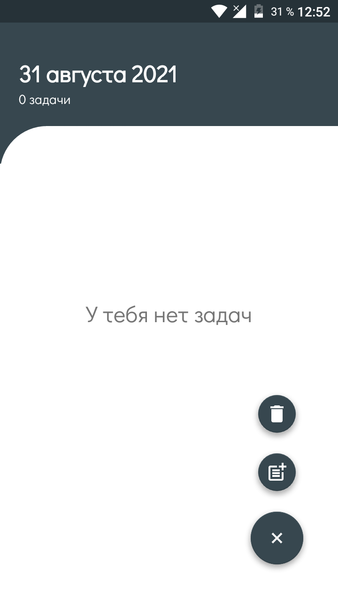
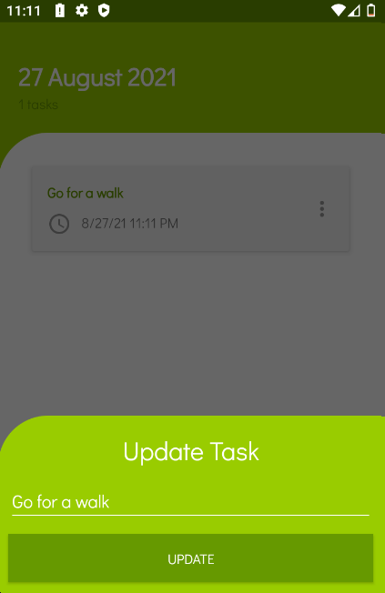
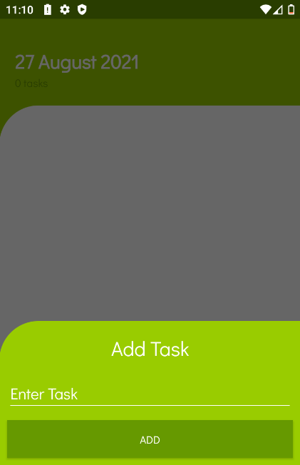

# To Do List

> Этот проект является частью моего обучения на Kotlin для разработки приложений для Android

____

## Screenshots:

    

____

### Техническое составляющее проекта:

- Kotlin
- MVVM
- Navigation Component
- Room
- Coroutine
- Material

____
